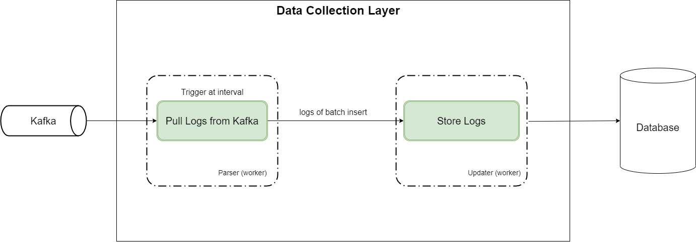

# Data Collection Layer
Simple Golang application that gets log data from pubsub and stores to the database


## Achitectural decision


We use worker pool for the DCL, we create bunch of background jobs that handle batch log processing.  
Each batch processing will be triggered with scheduled periodic job that has retry logic for the failed case.  
https://github.com/gocraft/work  


## How it works
- worker pool with background jobs will be created
- Every batch insert interval, new job will be triggered and pull logs from the Kafka
- The job will move to the next task(update) after getting batch insert amount of logs
- The job will do the database operation and will return to the worker pool

## Considerations
- We can have multiple worker pools for each services but for this task, simply created a pool that handles all services logs.  
In real project, we can have a pool for each service log processing.
- We can easily configure amount of concurrent workers in the pool.  
- We can easily add any further steps (business logic) to the worker tasks.  
For example, if we need to upload log file to the s3, then we can just add a worker definition and add a function that contains uploading logic.  
Right now, each worker has parse/update tasks.
- For data consistency between logs, and severities tables, we use transaction and it rollback if any of those operations are failed


## Prerequisites
docker-compose  
- https://docs.docker.com/compose/install

## How to run end-to-end testing
```sh
make test
```
- Producer publish logs that contain random severity/service name to the Kafka
- Application gets that logs and trigger job from worker pool every batch process interval time
- DB query app queries db every 30 seconds and shows the amount of logs and severities, content of severities


## How to do unittest
```sh
make unit-test
```